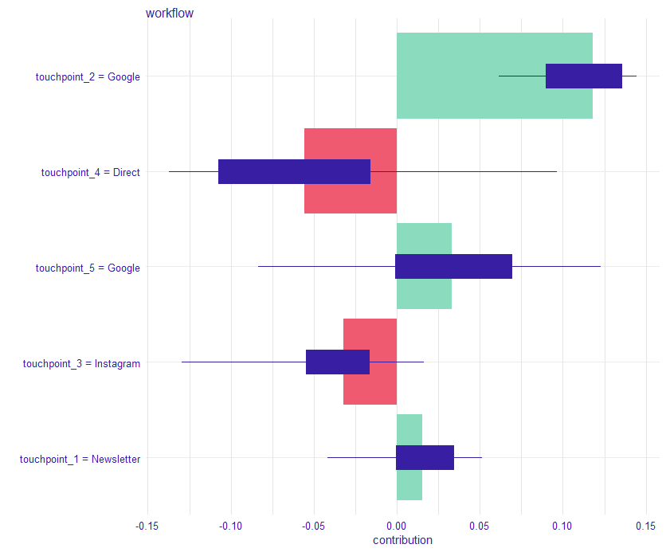

```{r xaringanExtra, echo=FALSE}
xaringanExtra::use_xaringan_extra(c("tile_view", "scribble"))
```

# Agenda

- Daten

- Methodischer Ansatz

- Vor- und Nachteile

- Validierung

- Alternativen

---

class: inverse, center, middle

# Daten

## Ziel: Bestimmung des Einflusses verschiedener Touchpoints auf einen Kauf bzw. Nicht-Kauf.

---

## Touchpoints

```{r, echo = FALSE}

tp_df <- data.frame(user_id = c(1, 1, 1, 2, 2, 2, 3, 3, 4, 4, 4, 4), 
           timestamp = c("2021-08-22 14:58:51", "2021-08-22 15:41:32", "2021-08-24 09:10:47",
                         "2021-08-21 13:22:08", "2021-08-22 10:33:59", "2021-08-22 10:45:50",
                         "2021-08-24 19:24:37", "2021-08-29 07:36:24", "2021-08-22 14:58:58",
                         "2021-08-22 17:18:20", "2021-08-23 11:29:10", "2021-08-30 20:23:04"), 
           touchpoint = c("Instagram", "Google", "Facebook", "Newsletter",
                          "Instagrm", "Direkzugriff", "Instagram", "Newsletter",
                          "Direktzugriff", "Google", "Facebook", "Newsletter"))

knitr::kable(tp_df)

```

---

## Kaufvorgänge

```{r, echo = FALSE}

conv_df <- data.frame(user_id = c(1, 3, 4),
                      timestamp = c("2021-08-24 09:12:30", 
                                    "2021-08-29 07:48:21", 
                                    "2021-08-30 21:00:47"))

knitr::kable(conv_df)

```

--

## Offene Fragen

--

Welche Touchpoints können wir zu einem Pfad zusammenfassen?

--

Welche Touchpoints werden einem (Nicht-)Kauf zugeordnet?

--

Was definiert einen Nicht-Kauf?

--

Technische Fragen: Wie identifiziere ich einen Nutzer bzw. einen Pfad?

---

class: inverse, center, middle

# Methodischer Ansatz


---

Auswahl des Modellansatzes basierend auf den Anforderungen, Datenbasis, Erwartungen, etc.

--

- Wie komplex sind die Zusammenhänge in den Daten?

--

- Wie interpretierbar muss das Modell sein?

--

- Wieviele Daten haben wir?

--

- Wieviele Ressourcen stehen zur Verfügung?

--

Ansätze:

- Regelbasiert
- Statistische Modellierung (Shapley-Values, Markov-Ketten)
- Erklärung durch *einfache* Regressionsmodelle
- Erklärung durch **Deep Learning**-Modelle (+ **XAI**)

--

ggf. stufenweises Vorgehen

--

Implementierung eines Baseline-Modells (regelbasiert bzw. einfaches statistisches Modell)

--

Anschließende Implementierung eines komplexeren Ansatzes

---

## Explainable AI

Kombination eines komplexen Machine Learning Modell und eines Erklärungsmodells

--

Das Machine Learning Modell sagt die Kaufentscheidung auf Basis der Touchpoints und ggf. 
anderer Daten (z.B. Alter/Geschlecht des Nutzers) vorher

--

Das Erklärungsmodell ermittelt den Einfluss der unterschiedlichen Features (z.B. Touchpoints)
auf die jeweilige Vorhersage für eine spezifische Kaufvorhersage


---

## ML Model

Für die Vorhersage der Kaufentscheidung benutzen wir ein neuronales Netz, z.B. RNN mit LSTM-Layer

```{r lstm_plot, eval=TRUE, echo=FALSE, warning=FALSE, message=FALSE}

library(ggplot2)
library(ggforce)
library(tibble)
library(dplyr)

lstm_data <- tibble(y = c(rep(1, 4), rep(2, 4), rep(3, 4), 4),
                    x= c(rep(1:4, times = 3), 2.5),
                    label = c("x1", "x2", "x[n-1]", "x[n]",
                              "w1", "w2", "w[n-1]", "w[n]",
                              "h1", "h2", "h[n-1]", "h[n]",
                              "y"))

ggplot(lstm_data) +
  geom_circle(data = lstm_data %>% filter(y == 1), aes(x0 = x, y0 = y, r = 0.2)) +
  geom_tile(data = lstm_data %>% filter(y > 1), aes(x = x, y = y), width = 0.4, 
            height = 0.2, fill = "gray", size = 2) +
  geom_text(aes(x = x, y = y, label = label), parse = TRUE) +
  geom_text(data = tibble(x = 2.5, y = 1:3, label = "..."), 
            aes(x = x, y = y, label = label), size = 15) +
  geom_segment(data = tibble(x0 = c(1.3, 3.3, rep(1:4, each = 2), 1:4),
                             x1 = c(1.7, 3.7, rep(1:4, each = 2), c(2.2, 2.4, 2.6, 2.8)), 
                             y0 = c(rep(3, 2), rep(1:2 + 0.3, 4), rep(3.1, 4)),
                             y1 = c(rep(3, 2), rep(2:3 - 0.3, 4), rep(3.9, 4))),
               aes(x = x0, xend = x1, y = y0, yend = y1), arrow = arrow(length = unit(0.5, "cm"))) +
  geom_text(data = tibble(x = 0, y = 1:4, label = c("Input", "Embedding", "LSTM", "Output")),
            aes(x = x, y = y, label = label)) +
  ylim(c(-0.1, 4.5)) +
  xlim(c(-0.1, 4.5)) +
  theme_void()

```

---

Der Input besteht aus einer Abfolge von Indikator-Vektoren für die einzelnen Touchpoints.
**Achtung**: Die Länge des Inputs kann dabei variieren

--

## Beispiel

5 mögliche Touchpoints (Facebook, Instagram, Newsletter, Google, Direkt)

--

**Facebook**  
$[1, 0, 0, 0, 0]$

**Google**  
$[0, 0, 0, 1, 0]$

--

Spezifischer Pfad: Instagram - Newsletter - Direkt - Kauf/Nicht-Kauf

$x = ([0,1,0,0,0], [0,0,1,0,0], [0,0,0,0,1])$

--

Der Output ist eine Kaufentscheidung, $y \in \{0, 1\}$

---

## Erklärungsmodell

Verwendung der SHAP-Methode (**Sh**apley **A**dditive ex**P**lanations)

--

Kombination eines lokalen Erklärungsmodells und Shapley Values

--

Lokales Erklärungsmodell wird eingesetzt, um ein komplexes Modell in einem bestimmten
Bereich anzunähern, um es dort erklärbar zu machen

--

Shapley-Werte haben ihren Ursprung in der Spieltheorie

- Wieviel trägt ein Spieler in einem kooperativen Spiel zum Gewinn bei?
- Spieler sind die einzelnen Touchpoints eines jeweiligen Pfads
- Gewinn ist der Kauf bzw. Nicht-Kauf eines Kunden

--

Ansatz: Wie wahrscheinlich ist der Kauf, wenn ein spezifischer Touchpoint nicht im Pfad
enthalten wäre? 
Um wieviel erhöht sich die Wahrscheinlichkeit, wenn der Touchpoint beteiligt ist?

---

```{r, echo = FALSE}

```

---

## Beispiel

Newsletter > Google-Suche > Instagram > Direktzugriff > Google-Suche

$$[0.03, 0.12, -0.03, -0.055, 0.03]$$

--

Negative Werte auf Null setzen

Restlichen Werte normieren und ggf. pro Touchpoint aggregieren

$$[0.17, 0.66, 0, 0, 0.17]$$

Newsletter: $17\%$

Google: $83\%$

Instagram: $0\%$

Direktzugriff: $0\%$

---

class: inverse, center, middle

# Vor- und Nachteile

---

## Vorteile

- Neuronales Netzt kann komplexe Zusammenhänge lernen
- Reihenfolge & Interaktionen werden berücksichtigt
- Attribution auf Pfadebene (keine globale Attribution)

## Nachteile

- Benötigt viele Daten
- Abhängig von Güte des Modells
- Klassifizierungsmodell ist schwer interpretierbar
- Rechenintensiv für viele Pfade

---

class: inverse, center, middle

# Validierung

---

Validierung des Klassifizierungsmodells auf Testdaten

- z.B. durch Accuracy oder ROC-AUC
- Je höher die Modellperformance, desto besser erklärt das Modell die Zusammenhänge

--

Maßnahmen basierend auf den Erkenntnissen

- Testen auf signifikante Effekte durch Anwendung der Maßnahmen
- Bestimmung des Lifts nach Anwendung der Maßnahmen

--

Nutzerumfragen

- *Wie sind Sie auf uns aufmerksam gewordern?*
- ...

